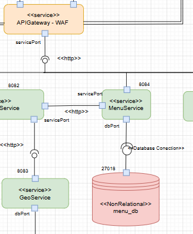
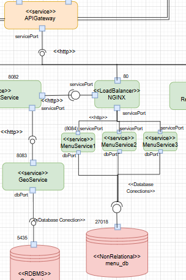
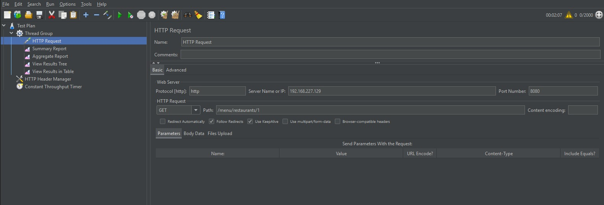
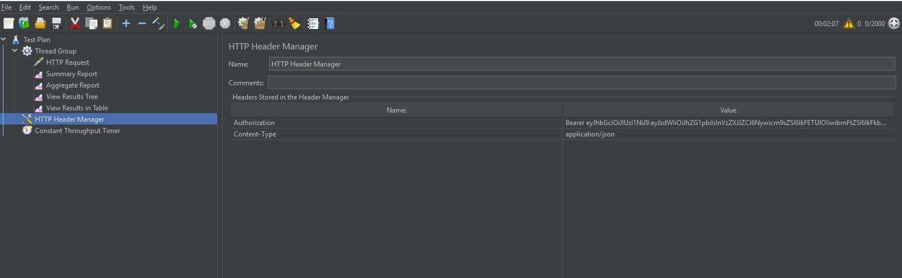
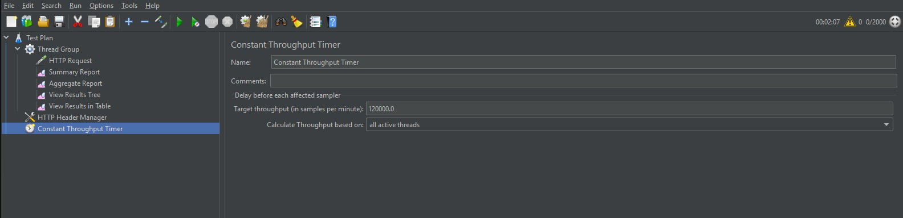
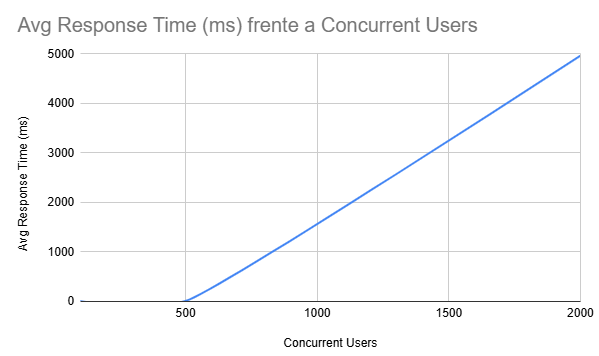

# Laboratory 5 — Performance & Scalability (2026-I)

## Project Title
ClickAndMunch

---

## 1. Team Information

**Team Name:** 1a

| # | Full Name                        |
|---|-----------------------------------|
| 1 | Michael Stiven Betancourt Gelves |
| 2 | Santiago Bejarano Ariza          |
| 3 | Santiago Suaza Montalvo          |
| 4 | Julian David Ruiz Ramos          |
| 5 | Manuel Felipe Espinosa Español   |
| 6 | Manuel Santiago Mori Ardila      |

---

# 2. Pull Request

[Here is the pr link](https://github.com/unal-sw-arch/swarch-2026i/pull/33)

---

# 3. Architectural View

## Pattern Applied
**Load Balancer Pattern**

## Performance Tactic
The main implemented tactic is **Maintain Multiple Copies of
Computationss** and **increase available computational resource** by distributing incoming requests across multiple service instances.

---

## Architectural Diagram

> Before Load Balancer


> After Load Balancer


> Main Changes

Before




After




The API Gateway was modified to route Menu Service requests through an NGINX Load Balancer instead of directly accessing the service. The NGINX component distributes incoming traffic across three Menu Service instances using a Round Robin strategy, improving scalability and load distribution.

----------

## Components Involved


| Component                  | Responsibility                                                  |
|----------------------------|-----------------------------------------------------------------|
| API Gateway                | Receives external client requests and routes them internally    |
| NGINX Load Balancer        | Distributes incoming traffic across service instances           |
| Menu Service Instances | Process Menu requests concurrently                          |

----------

## Connectors Affected

1. API Gateway → Menu Service
Replaced by API Gateway → NGINX Load Balancer

2. Load Balancer → Menu Service Instances
New connector introduced by the pattern

----------

## New Elements Introduced by the Pattern

NGINX Load Balancer:
- Traffic distribution
- Multiple Checkout Instances
- Horizontal scalability
- Upstream Pool Configuration
- Defines balancing targets

----------

## Tradeoffs

The Load Balancer pattern introduces clear benefits in system performance, reflected in increased throughput, reduced response time, improved availability, and greater elasticity under load. However, these improvements come with tradeoffs, including added system complexity and the need for proper configuration and scaling strategies. Overall, the pattern enhances scalability and resilience, making the system more capable of handling high concurrency workloads.

----------

# 4. Technical Guide

# 4.1 Pattern Description

The **Load Balancer** pattern distributes incoming requests among multiple service instances to prevent overload on a single node and improve scalability, availability, and response time stability.

In this laboratory, NGINX was used as a load balancer (could also be considered a reverse proxy, since its routing traffic) between the API Gateway and the Menu Service instances.

The selected balancing strategy was:
-   Round Robin: It was selected because the Checkout Service instances are homogeneous and stateless, making equal request distribution an effective and simple solution. The algorithm introduces low overhead, is easy to configure, and provides predictable behavior during load testing and scalability analysis.
    

### Main Performance Tactics Implemented

- Maintain Multiple Copies of
Computationss
- Increase available computational resource
    

----------

# 4.2 Quality Scenario

| Attribute          | Description |
|--------------------|-------------|
| **Source**         | Clients/Users |
| **Stimulus**       | The users generate 100 menu requests per second (100 req/s) |
| **Artifact**       | Load Balancer and Menu Service instances |
| **Environment**    | Normal operation in a local development environment |
| **Response**       | The load balancer distributes incoming requests evenly across the available Menu Service instances |
| **Response Measure** | - Response time < 300 ms  <br> - CPU utilization < 80%  <br> - Error rate < 1% |

----------
The Load Balancer pattern was selected to distribute high request volumes across multiple service instances, improving scalability, reducing response times, and preventing overload on a single instance.

# 4.3 Implementation Steps

## Step 1 — Analyze Possible Bottleneck

Initially, the system used a single Menu Service instance, potentially causing service saturation during high request concurrency.

### Observed Problems

-   Increased response times 
-   Service saturation   
-   Request failures under high concurrency   
-   Uneven resource utilization
    

----------

## Step 2 — Create Multiple Service Instances

Multiple Menu Service containers were deployed.

```yaml
menu-service-1
menu-service-2
menu-service-3
```

### Number of Instances

3 instances of menu service

----------

## Step 3 — Configure NGINX as Load Balancer

NGINX was configured as a load balancer (reverse proxy) with an upstream pool.

### Goals

-   Distribute traffic
    
-   Improve concurrency handling
    
-   Prevent overload on a single instance
    

----------

## Step 4 — Connect API Gateway to Load Balancer

The API Gateway was modified to communicate only with the NGINX node instead of directly accessing the individual service.

----------

## Step 5 — Execute Load Tests

Load tests were performed after applying the pattern to find the 'knee' point.

### Tool Used

-   JMeter
  
----------

# 4.4 Configuration or Code Snippets

## NGINX Upstream Configuration

```nginx
http {
    upstream menu_service {
        server backend-menuservice-1:8084;
        server backend-menuservice-2:8084;
        server backend-menuservice-3:8084;
    }

    server {
        listen 80;

        location / {
            proxy_pass http://menu_service;

            proxy_set_header Host $host;
            proxy_set_header X-Real-IP $remote_addr;
            proxy_set_header X-Forwarded-For $proxy_add_x_forwarded_for;
        }
    }
}

```

----------

## Docker Compose Example

```yaml
nginx-menu:
    image: nginx:alpine
    container_name: nginx-menu
    ports:
      - "8084:80"   # optional (only for debugging, can remove later)
    volumes:
      - ./nginx/menu.conf:/etc/nginx/nginx.conf:ro
    healthcheck:
      test: ["CMD-SHELL", "wget -qO- http://127.0.0.1/actuator/health || exit 1"]
      interval: 10s
      timeout: 5s
      retries: 5
      start_period: 10s
    depends_on:
      menuservice:
        condition: service_healthy
    networks:
      - appnet

```

----------

## API Gateway Routing Example

```yaml
SERVICES_MENU_URL: http://nginx-menu

```

----------

# 4.5 Load Test Results

## Test Configuration








The test was performed using direct HTTP Requests in JMeter instead of browser recording because the browser proxy configuration required for the recorder was not functioning correctly.

----------

## Results Table


| Concurrent Users | Avg Response Time (ms) | Error Rate (%) | Throughput (req/s) |
|------------------|------------------------|----------------|--------------------|
| 100               | 4.75                | 0        | 102.1            |
| 500              | 7.86                | 0        | 499.4            |
| 2000              | 4967                | 6        | 500 avg            |


----------

## Performance Curve




The resulting performance curve does not clearly exhibit a smooth or well-defined knee shape, likely due to the limited number of test points. A more granular set of measurements around the high-concurrency region would make the transition point more precise. However, the current results still provide a reasonable estimate, indicating that the knee occurs at fewer than 2000 concurrent users.

----------

## Knee of the Curve

The knee of the performance curve was identified at fewer than 2000 concurrent users, where response times and error rates began to increase rapidly. Beyond this point, system resources became saturated, causing request queues, higher latency, and performance degradation that resulted in worse metrics than tests with lower concurrency levels.

----------

# 4.6 Results

The performance tests allowed the identification of the system’s knee point, which occurred at fewer than 2000 concurrent users. Up to this point, the system maintained stable response times and acceptable throughput levels.


## Discussion

The performance tests conducted after applying the Load Balancer pattern provided insight into how the system behaves under increasing concurrency. The results show that the system maintains stable response times up to the identified knee point (below 2000 users), after which response times increase significantly and saturation effects become evident.

Although no direct before-and-after comparison tests were performed, the observed behavior suggests that the introduction of NGINX and multiple Menu Service instances improves request distribution and overall scalability. The system is able to handle moderate-to-high loads more effectively, while still exhibiting expected degradation once resource limits are reached.


----------

# 4.7 Recommendations

## Recommendation 1

Use health checks in the load balancer configuration to avoid routing traffic to unhealthy service instances.

----------

## Recommendation 2

Monitor CPU, memory usage, and request distribution during load testing to identify hidden bottlenecks.

----------

## Recommendation 3

Use realistic traffic patterns and gradual ramp-up testing to better identify the knee of the curve.

----------