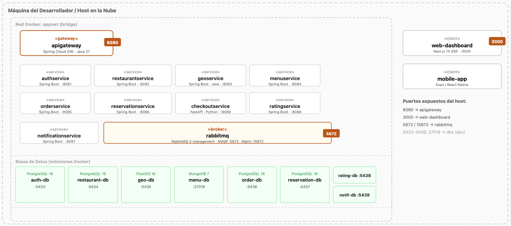
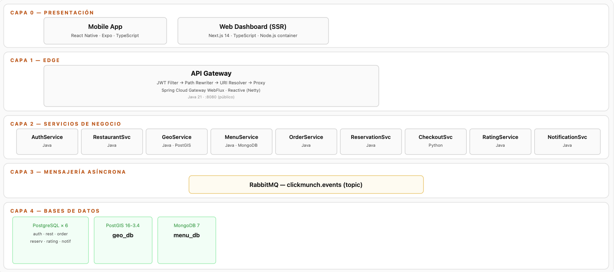
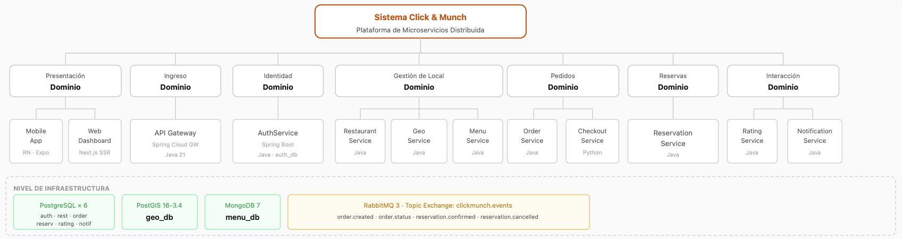

# Click & Munch

<!-- Logo placeholder: replace the path below with the actual logo file -->
<p align="center">
  
</p>

## 1. Team

**Team Name:** 1a

| # | Full Name |
|---|-----------|
| 1 | Michael Stiven Betancourt Gelves |
| 2 | Santiago Bejarano Ariza |
| 3 | Santiago Suaza Montalvo|
| 4 | Julian David Ruiz Ramos |
| 5 | Manuel Felipe Espinosa Español |
| 6 | Manuel Santiago Mori Ardila |

---

## 2. Software System

**Name:** Click & Munch

**Description:**

Click & Munch is a digital platform designed to streamline the dining experience at restaurants and bars. The system allows customers to browse nearby establishments, explore their menus, and place pre-orders before arriving at the venue. By enabling customers to reserve tables and submit their food and drink selections in advance, Click & Munch significantly reduces waiting times upon arrival—meals and beverages can be prepared ahead of time so that service begins almost immediately when the customer is seated.

For restaurant owners and managers, the platform provides a comprehensive dashboard to manage restaurant profiles, define and update menu categories and items (including images and pricing), and monitor incoming orders in real time. Chefs see new orders appear instantly on a kitchen board and advance them through a strict state machine (PENDING → IN_PREPARATION → READY → DELIVERED), with per-unit special instructions (e.g. "sin lechuga") so two of the same dish in one order can have different preparations. The system supports role-based access for different staff members (managers, waiters, chefs), ensuring that each team member sees only the information relevant to their responsibilities.

The architecture is built around independent microservices—authentication, restaurant management, geolocation, menu management, order lifecycle, reservations, notifications, ratings, and checkout orchestration—connected through a centralized API Gateway that acts as the single public entry point for both REST traffic and the realtime STOMP/WebSocket channel that pushes kitchen events to chefs the moment a waiter places an order. Asynchronous events flow between services via RabbitMQ. This design ensures scalability, fault isolation, and the ability to evolve each service independently as the platform grows.

**General-purpose languages used in the code base:**

- **Java** for the Spring Boot backend microservices and API Gateway.
- **Python** for the CheckoutService implemented with FastAPI.
- **TypeScript** for the web dashboard and the mobile application code.
- **JavaScript** for frontend and tooling configuration files in the workspace.

---

## 3. Architectural Structures

---

### 3.1 Component-and-Connector (C&C) Structure

#### C&C View


#### Description of Architectural Elements and Relations

**Components (Services):**

| Component | Technology | Responsibility |
|-----------|-----------|----------------|
| **API Gateway** | Spring Cloud Gateway WebFlux (Java 21, Netty) | Single public ingress on `:8080`. Routes REST traffic, enforces JWT on protected routes, handles CORS, and proxies HTTP→WebSocket upgrades for the kitchen channel. |
| **AuthService** | Spring Boot 4, JDBC, PostgreSQL | User registration, login, JWT generation, and user lookup. |
| **RestaurantService** | Spring Boot 4, JDBC, PostgreSQL | Restaurant CRUD, owner validation (via AuthService), nearby search (via GeoService), menu aggregation (via MenuService). |
| **GeoService** | Spring Boot 4, JDBC, PostGIS | Geospatial location storage, proximity queries, distance and ETA calculation. Internal-only. |
| **MenuService** | Spring Boot 4, MongoDB | Menu category and item management per restaurant. |
| **OrderService** | Spring Boot 4, JDBC, PostgreSQL, STOMP, RabbitMQ | Order lifecycle state machine. One DB row per ordered unit for per-unit notes. Publishes events to RabbitMQ; pushes realtime events over STOMP. |
| **ReservationService** | Spring Boot 4, JDBC, PostgreSQL, RabbitMQ | Table reservations, capacity management, order linking. Publishes events to RabbitMQ. |
| **NotificationService** | Spring Boot 4, JDBC, PostgreSQL, RabbitMQ, SSE | Consumes events from RabbitMQ, persists notifications, streams to clients via SSE. |
| **RatingService** | Spring Boot 4, JDBC, PostgreSQL | Restaurant and waiter ratings with aggregate score summaries. |
| **CheckoutService** | **Python 3.12 / FastAPI / httpx** | Saga orchestrator: validates reservation → creates order → links reservation. No own database. |
| **RabbitMQ** | RabbitMQ 3 (AMQP) | Async event bus decoupling OrderService/ReservationService from NotificationService. |
| **Web Dashboard** | React 19, TypeScript, Vite, TailwindCSS | Admin panel; Chef Kitchen page subscribes to STOMP realtime channel. |
| **Mobile App** | React Native, Expo SDK 54, Zustand, React Query | Customer-facing browsing, reservations, and ordering. |

**Connectors (Relations):**

| From | To | Protocol | Description |
|------|----|----------|-------------|
| Mobile / Dashboard | API Gateway | HTTP/REST | All REST enters on port 8080. |
| Dashboard Chef view | API Gateway | WebSocket/STOMP | `ws://gateway:8080/ws/kitchen` |
| API Gateway | AuthService | HTTP | `/auth/**` → `/api/auth/**` (public) |
| API Gateway | RestaurantService | HTTP | `/restaurant/**` (JWT-protected) |
| API Gateway | MenuService | HTTP | `/menu/**` (JWT-protected) |
| API Gateway | OrderService | HTTP + WebSocket | `/order/**` + `/ws/kitchen` proxy |
| API Gateway | ReservationService | HTTP | `/reservation/**` (JWT-protected) |
| API Gateway | CheckoutService | HTTP | `/checkout/**` (JWT-protected) |
| API Gateway | RatingService | HTTP | `/rating/**` (JWT-protected) |
| API Gateway | NotificationService | HTTP + SSE | `/notification/**` (JWT-protected) |
| CheckoutService | ReservationService | HTTP | Validate & link reservation |
| CheckoutService | OrderService | HTTP | `POST /api/orders` |
| RestaurantService | AuthService | HTTP | Owner identity validation |
| RestaurantService | GeoService | HTTP | Location creation and nearby search |
| RestaurantService | MenuService | HTTP | Menu aggregation |
| OrderService | RabbitMQ | AMQP | Publish `ORDER_CREATED`, `ORDER_STATUS_CHANGED` |
| ReservationService | RabbitMQ | AMQP | Publish `RESERVATION_CREATED` |
| RabbitMQ | NotificationService | AMQP | Event delivery |
| Each service | Own DB | JDBC / MongoDB | Each service owns exactly one database |

#### Description of Architectural Styles

| Style | Where Applied | Description |
|-------|---------------|-------------|
| **Microservices** | Entire backend | The backend is decomposed into independently deployable services, each with its own bounded responsibility and data ownership. |
| **Client-Server** | Frontend ↔ Backend | The mobile app and dashboard act as clients that consume backend capabilities through the API Gateway. |
| **Layered Architecture** | Each microservice | Each service separates presentation, business logic, and data access responsibilities to reduce coupling. |
| **Event-Driven Architecture** | Order, Reservation, Notification flows | Domain events propagate asynchronously through RabbitMQ to decouple producers from consumers. |

#### Description of Architectural Patterns

| Pattern | Where Applied | Description |
|---------|---------------|-------------|
| **API Gateway** | APIGateway | A single entry point handles routing, JWT enforcement, CORS, and WebSocket proxying. |
| **Saga (Orchestration)** | CheckoutService | Checkout coordinates a multi-step transaction across ReservationService and OrderService and handles partial failure points. |
| **Publish/Subscribe** | RabbitMQ bus | OrderService and ReservationService publish events; NotificationService subscribes asynchronously. |
| **Pipe-and-Filter** | Gateway pipeline | Requests pass through authentication, path rewriting, and forwarding stages before reaching downstream services. |
| **State Machine** | OrderService | Order status transitions are constrained to valid lifecycle changes only. |
| **Repository** | Data layer | Spring Data repositories encapsulate persistence concerns behind repository interfaces. |

---

### 3.2 Deployment Structure

#### Deployment View

All backend components run as Docker containers on a single host within the `appnet` bridge network.



#### Description of Architectural Elements and Relations

| Element | Type | Description |
|---------|------|-------------|
| **Host Machine** | Execution environment | Runs Docker Engine; Docker Compose orchestrates all containers. |
| **appnet** | Docker bridge network | Private virtual network; containers communicate via DNS service names (e.g., `http://authservice:8081`). |
| **apigateway** | Container | Only externally reachable service endpoint; binds host port 8080. |
| **`*service` containers** | Containers | `expose`d (visible inside `appnet`) but not `port`-published to the host. |
| **`*-db` containers** | Containers | Backing stores; host ports published for dev inspection only. |
| **rabbitmq** | Container | AMQP broker; ports 5672 and 15672 published to the host. |
| **Health checks** | Dependency mechanism | Every container declares a health check; `depends_on: condition: service_healthy` prevents startup race conditions. |

#### Description of Architectural Patterns

| Pattern | Description |
|---------|-------------|
| **Containerisation** | Every component is a Docker image; environment parity between dev and production. |
| **Service discovery via DNS** | Docker Compose `appnet` resolves container names; inter-service URLs are environment variables. |
| **Single-edge ingress** | Only the API Gateway is published externally, shrinking the attack surface. |
| **Externalized configuration** | DB URLs, credentials, and inter-service URLs injected via Docker Compose environment variables (Twelve-Factor App). |

---

### 3.3 Layered Structure

#### Layered View

Every microservice (Java and Python) follows the same four-layer vertical slice:



#### Description of Architectural Elements and Relations

| Layer | Element | Responsibility |
|-------|---------|----------------|
| **Presentation** | Controllers / routers | Accept HTTP requests, validate input, map to DTOs, return structured responses. Never contain business logic. |
| **Business Logic** | Service classes / functions | Enforce business rules, drive state machines, orchestrate HTTP calls to other services. |
| **Data Access** | Repository interfaces | Encapsulate all persistence queries. CheckoutService (Python) has no data access layer — it is a pure orchestrator. |
| **Infrastructure** | Databases, RabbitMQ, external clients | Backing stores and messaging transport. Never called directly from controllers. |

#### Description of Architectural Patterns

| Pattern | Description |
|---------|-------------|
| **Layered (N-Tier)** | Strict unidirectional dependency: presentation → business → data → infrastructure. No layer skipping. |
| **DTO pattern** | Java records and Pydantic models are immutable transfer objects; entities are never exposed in API responses. |
| **Repository pattern** | Persistence mechanism (PostgreSQL, MongoDB) is hidden behind interfaces and swappable without touching business logic. |
| **Dependency Injection** | Spring IoC (Java) and FastAPI's dependency system (Python) wire components at startup, enabling unit-testable mock substitution. |

---

### 3.4 Decomposition Structure

#### Decomposition View

The system is decomposed into five functional domains grouped by business capability:



#### Description of Architectural Elements and Relations

| Domain | Services | Responsibility Boundary |
|--------|----------|------------------------|
| **Ingress** | API Gateway | All client-facing concerns: routing and security. No business logic. |
| **Identity & Access** | AuthService | User identity and JWT issuance. Consumed by the gateway and RestaurantService. |
| **Venue Management** | RestaurantService, GeoService, MenuService | Venue profile, location, and menu. GeoService is internal-only. |
| **Ordering** | CheckoutService ★, OrderService, ReservationService | End-to-end purchase flow. CheckoutService (Python) is the saga entry point. |
| **Customer Engagement** | NotificationService, RatingService | Realtime alerts and post-experience reviews. |
| **Infrastructure** | RabbitMQ | Shared event bus; decouples producers from consumers. |

**Boundary rules:**
- Cross-domain communication uses only REST (sync) or RabbitMQ (async).
- Intra-domain REST calls are allowed (e.g., RestaurantService → GeoService); cross-database access is forbidden.
- The Ingress domain contains no business logic; it is a traffic director only.

---

## 4. Prototype

### Prerequisites

- **Docker** and **Docker Compose** (for the backend)
- **Node.js** ≥ 18 and **npm** (for the frontends)
- **Expo CLI** (for the mobile app): `npm install -g expo-cli`

### Backend

The backend stack comprises 10 microservices, 8 backing databases, and 1 RabbitMQ broker — all orchestrated by Docker Compose (29 containers total).

```bash
# 1. Clone the repository
git clone <repository-url>
cd ClickAndMunchApp

# 2. Build and start all backend services
cd backend
docker compose up --build -d

# 3. Verify all containers are healthy
docker compose ps
```

All containers should show **"(healthy)"**. Public endpoints:

- REST API: `http://localhost:8080`
- Kitchen WebSocket: `ws://localhost:8080/ws/kitchen`
- RabbitMQ Management: `http://localhost:15672` (user: `mike` / `secret`)

| Service | Host port | Notes |
|---------|----------:|-------|
| API Gateway (REST + WebSocket) | **8080** | Only public edge |
| AuthService | — | Internal only |
| RestaurantService | — | Internal only |
| GeoService | — | Internal only |
| MenuService | — | Internal only |
| OrderService | — | Internal only (REST + WS) |
| ReservationService | — | Internal only |
| NotificationService | — | Internal only (REST + SSE) |
| RatingService | — | Internal only |
| CheckoutService ★ Python | — | Internal only |
| RabbitMQ (AMQP) | **5672** | |
| RabbitMQ Management UI | **15672** | |
| auth_db (PostgreSQL) | 5433 | Dev inspection |
| restaurant_db (PostgreSQL) | 5434 | Dev inspection |
| geo_db (PostGIS) | 5435 | Dev inspection |
| order_db (PostgreSQL) | 5436 | Dev inspection |
| menu_db (MongoDB) | 27018 | Dev inspection |
| reservation_db (PostgreSQL) | 5437 | Dev inspection |
| rating_db (PostgreSQL) | 5438 | Dev inspection |
| notification_db (PostgreSQL) | 5439 | Dev inspection |

**Gateway routes:**

| Route | Service |
|-------|---------|
| `/auth/**` | AuthService |
| `/restaurant/**` | RestaurantService |
| `/menu/**` | MenuService |
| `/order/**` | OrderService |
| `/ws/kitchen` | OrderService WebSocket |
| `/reservation/**` | ReservationService |
| `/checkout/**` | CheckoutService (Python/FastAPI) |
| `/rating/**` | RatingService |
| `/notification/**` | NotificationService |

**Quick test — register and log in:**

```bash
curl -X POST http://localhost:8080/auth/register \
  -H "Content-Type: application/json" \
  -d '{"name":"Test User","email":"test@example.com","username":"testuser","password":"123456","role":"CUSTOMER"}'

curl -X POST http://localhost:8080/auth/login \
  -H "Content-Type: application/json" \
  -d '{"username":"testuser","password":"123456"}'
```

**Place an order (waiter flow):**

```bash
curl -X POST http://localhost:8080/order \
  -H "Content-Type: application/json" \
  -H "Authorization: Bearer <jwt>" \
  -d '{
    "restaurantId": 1,
    "tableNumber": 5,
    "notes": "Mesa junto a la ventana",
    "items": [
      {"itemName": "Hamburguesa", "notes": "sin lechuga"},
      {"itemName": "Hamburguesa", "notes": "con todo"}
    ]
  }'
```

**Full checkout (customer flow via Python CheckoutService):**

```bash
curl -X POST http://localhost:8080/checkout \
  -H "Content-Type: application/json" \
  -H "Authorization: Bearer <jwt>" \
  -d '{
    "customerId": 1,
    "customerName": "Test User",
    "restaurantId": 1,
    "restaurantName": "El Rincón",
    "items": [
      {"menuItemId": "abc123", "productName": "Hamburguesa", "quantity": 2, "unitPrice": 15000}
    ],
    "paymentMethod": "CARD"
  }'
```

**Other useful reads:**

```bash
curl -H "Authorization: Bearer <jwt>" http://localhost:8080/restaurant/owner/1
curl -H "Authorization: Bearer <jwt>" http://localhost:8080/menu/restaurants/1
curl -H "Authorization: Bearer <jwt>" http://localhost:8080/order/kitchen/1
curl -H "Authorization: Bearer <jwt>" "http://localhost:8080/order/restaurant/1?status=PENDING"
curl -H "Authorization: Bearer <jwt>" http://localhost:8080/notification
```

**Stop the backend:**

```bash
docker compose down
```

---

### Frontend — Web Dashboard

```bash
cd frontend/dashboard
npm install
npm run dev
```

Available at `http://localhost:5173`. Kitchen view at `/kitchen`.

---

### Frontend — Mobile App

```bash
cd frontend/mobile
npm install
npx expo start
```

- Press **i** — iOS Simulator
- Press **a** — Android Emulator
- Scan QR code with **Expo Go** on your phone
