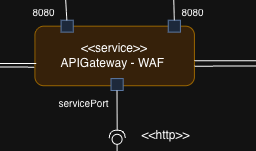

# Laboratorio 4. Security

**Curso:** Arquitectura de Software · 2026-I  
**Plataforma:** ClickMunch (entrega de comida a domicilio)

---

## 4.1 Información del Equipo

| # | Nombre |
|--|---|
| 1 | Michael Stiven Betancourt Gelves |
| 2 | Santiago Bejarano Ariza |
| 3 | Santiago Suaza Montalvo|
| 4 | Julian David Ruiz Ramos |
| 5 | Manuel Felipe Espinosa Español |
| 6 | Manuel Santiago Mori Ardila |

---

## 4.2 Vistas Arquitectónicas


En este diagrama podemos ver que, debido a que el API Gateway ya se encontraba presente y la implementación del WAF se realizó en este servicio, aclaramos en la vista de C&C la implementación.

Al acercarnos al diagrama, podemos ver que el API Gateway ahora también realiza la tarea de WAF:



Es por este motivo que el diagrama no cambia su estructura, pero la funcionalidad del API Gateway 

---

## Technical Guide: 

### Pattern Description: 
El Patrón WAF permite realizar un análisis del contenido del body de las peticiones mediante un listado de patrones.  El WAF implementa un filtro global con listas que contienen expresiones regulares asociadas a peticiones maliciosas conocidas.  El patrón de WAF funciona como la primera línea de defensa.  Al darle la máxima prioridad en la cadena de seguridad aseguramos que el tráfico malicioso sea bloqueado antes de que el sistema gaste recursos en validar tokens JWT, hacer consultas a la base de datos o enrutar la petición al microservicio de destino. 

El patrón del WAF en el atributo de calidad específico establece filtros como: 
* **SQLI**: Detecta palabras reservadas (SELECT, DROP) o manipulaciones lógicas (OR 1=1). 
* **XSS**: Busca etiquetas `<script>`, eventos de JavaScript o iframes inyectados. 
* **Path Traversal**: Bloquea intentos de saltar directorios (`../`) o acceder a archivos sensibles del sistema operativo (`/etc/passwd`). 

El patrón de WAF considera elementos como que los atacantes normalmente no envían un ataque en texto plano sino que suelen ofuscarlo usando codificación URL (ej. `%3Cscript%3E` en lugar de `<script>`).  Los más avanzados usan "doble codificación" para engañar a los WAFs simples, esto es algo que se busca mitigar.  Un WAF debe equilibrar la seguridad con el performance, sin embargo, este atributo de calidad suele ser uno de los TradeOffs en la implementación del WAF.

### Quality Scenario: 

| Component | Answer |
| :--- | :--- |
| **Source** | Threat actor - External (Unknown)  |
| **Stimulus** | SQL Injection Attempt on Login Form  |
| **Artifact** | API Gateway  |
| **Environment** | Normal Operation - Production  |
| **Response** | Recognize pattern and Block IP  |
| **Response Measure** | Recognize attack pattern < 200ms, Block IP < 2s  |

---

## Implementation Steps: 

### Consideraciones de Arquitectura y Requisitos Previos 
Antes de proceder a incluir el código, hay que verificar que el proyecto cumpla con las siguientes condiciones: 
* El API Gateway debe estar definido como un proyecto reactivo basado exclusivamente en Spring WebFlux.
* Exclusión obligatoria: Hay que asegurarse de que el proyecto no contenga la dependencia `spring-boot-starter-web` (Tomcat). 
* Spring Cloud Gateway necesita que se use el motor de red reactivo de Netty para operar de manera correcta;  la convivencia de ambas dependencias puede ocasionar fallos críticos en el arranque del servicio. 

### Configuración de Dependencias (Ecosistema Maven) 
Modificar el archivo de configuración de dependencias `pom.xml` del API Gateway para importar el BOM de Spring Cloud y el iniciador de Gateway correspondiente: 

```xml
<dependencyManagement> 
    <dependencies> 
        <dependency> 
            <groupId>org.springframework.cloud</groupId> 
            <artifactId>spring-cloud-dependencies</artifactId> 
            <version>2023.0.1</version> 
            <type>pom</type> 
            <scope>import</scope> 
        </dependency> 
    </dependencies> 
</dependencyManagement> 
    <dependencies> 
        <dependency> 
            <groupId>org.springframework.cloud</groupId> 
            <artifactId>spring-cloud-starter-gateway</artifactId> 
            </dependency> 
            </dependencies> 
```

### Creación del Filtro WAF Global (WafFilter.java) 
Generar una clase llamada `WafFilter.java` dentro del paquete del API Gateway a la seguridad o los componentes de filtrado de su aplicación.  El uso de la anotación `@Component` permitirá a Spring Boot detectar automáticamente la clase, mientras que la interfaz `GlobalFilter` va a asegurar que se aplique automáticamente el filtro sobre todo el tráfico entrante, sin necesidad de declaraciones manuales en el mapeo de rutas: 

```java
package com.<Nombre_del_proyecto>.APIGateway.security; // 

import java.net.URLDecoder;
import java.nio.charset.StandardCharsets;
import java.util.List;
import java.util.regex.Pattern;

import org.slf4j.Logger;
import org.slf4j.LoggerFactory;
import org.springframework.cloud.gateway.filter.GatewayFilterChain;
import org.springframework.cloud.gateway.filter.GlobalFilter;
import org.springframework.core.Ordered;
import org.springframework.core.io.buffer.DataBuffer;
import org.springframework.http.HttpHeaders;
import org.springframework.http.HttpMethod;
import org.springframework.http.HttpStatus;
import org.springframework.http.MediaType;
import org.springframework.http.server.reactive.ServerHttpRequest;
import org.springframework.http.server.reactive.ServerHttpResponse;
import org.springframework.stereotype.Component;
import org.springframework.web.server.ServerWebExchange;

import reactor.core.publisher.Mono;

@Component
public class WafFilter implements GlobalFilter, Ordered {

    private static final Logger logger = LoggerFactory.getLogger(WafFilter.class);

    /** Header values worth screening (classic reflected-injection vectors). */
    private static final List<String> SCREENED_HEADERS = List.of(
            HttpHeaders.REFERER,
            HttpHeaders.ORIGIN,
            "X-Forwarded-For",
            "X-Forwarded-Host");

    private static final List<Pattern> SQL_INJECTION = List.of(
            Pattern.compile("(?i)\\b(union\\s+select|select\\s+.+\\s+from\\s+|insert\\s+into\\s+|update\\s+.+\\s+set\\s+|delete\\s+from\\s+|drop\\s+(table|database)|truncate\\s+table|alter\\s+table)"),
            Pattern.compile("(?i)\\b(or|and)\\b\\s+['\"]?\\d+['\"]?\\s*=\\s*['\"]?\\d+"),
            Pattern.compile("(?i)(;|--|#|/\\*|\\*/)\\s*(drop|select|insert|update|delete|union)\\b"),
            Pattern.compile("(?i)\\b(sleep|benchmark|pg_sleep|load_file|information_schema)\\s*\\(?"),
            Pattern.compile("(?i)'\\s*(or|and)\\s*'"));

    private static final List<Pattern> XSS = List.of(
            Pattern.compile("(?i)<\\s*script"),
            Pattern.compile("(?i)<\\s*/?\\s*(iframe|img|svg|object|embed|body|video|audio|link|style)\\b"),
            Pattern.compile("(?i)javascript\\s*:"),
            Pattern.compile("(?i)\\bon(error|load|click|mouseover|focus|submit|toggle)\\s*="),
            Pattern.compile("(?i)(document\\.cookie|document\\.location|window\\.location|eval\\s*\\(|alert\\s*\\()"));

    private static final List<Pattern> PATH_TRAVERSAL = List.of(
            Pattern.compile("(\\.\\./|\\.\\.\\\\)"),
            Pattern.compile("(?i)(/etc/passwd|/etc/shadow|c:\\\\windows|boot\\.ini)"),
            Pattern.compile("\\x00"));

    @Override
    public Mono<Void> filter(ServerWebExchange exchange, GatewayFilterChain chain) {
        ServerHttpRequest request = exchange.getRequest();

        // CORS preflight carries no exploitable payload; let it through so the
        // gateway's CORS handling is not disturbed.
        if (request.getMethod() == HttpMethod.OPTIONS) {
            return chain.filter(exchange);
        }

        String hit = firstMatch(safeDecode(request.getPath().value()));
        if (hit == null) {
            hit = firstMatch(safeDecode(request.getURI().getRawQuery()));
        }
        if (hit == null) {
            hit = screenHeaders(request.getHeaders());
        }

        if (hit != null) {
            logger.warn("WAF blocked request: method={} path={} clientIp={} rule={}",
                    request.getMethod(), request.getPath().value(), clientIp(request), hit);
            return reject(exchange);
        }
        return chain.filter(exchange);
    }

    private String screenHeaders(HttpHeaders headers) {
        for (String name : SCREENED_HEADERS) {
            List<String> values = headers.get(name);
            if (values == null) {
                continue;
            }
            for (String value : values) {
                String hit = firstMatch(safeDecode(value));
                if (hit != null) {
                    return hit + " (header:" + name + ")";
                }
            }
        }
        return null;
    }

    /** @return a short rule id if the value matches an attack signature, else {@code null}. */
    private String firstMatch(String value) {
        if (value == null || value.isEmpty()) {
            return null;
        }
        for (Pattern p : SQL_INJECTION) {
            if (p.matcher(value).find()) {
                return "SQLI";
            }
        }
        for (Pattern p : XSS) {
            if (p.matcher(value).find()) {
                return "XSS";
            }
        }
        for (Pattern p : PATH_TRAVERSAL) {
            if (p.matcher(value).find()) {
                return "PATH_TRAVERSAL";
            }
        }
        return null;
    }

    /** Decode up to two passes to defeat single/double percent-encoding evasion. */
    private String safeDecode(String value) {
        if (value == null) {
            return null;
        }
        String decoded = value;
        for (int i = 0; i < 2; i++) {
            try {
                String next = URLDecoder.decode(decoded, StandardCharsets.UTF_8);
                if (next.equals(decoded)) {
                    break;
                }
                decoded = next;
            } catch (IllegalArgumentException ex) {
                break; // malformed encoding; screen what we already have
            }
        }
        return decoded;
    }

    private String clientIp(ServerHttpRequest request) {
        String xff = request.getHeaders().getFirst("X-Forwarded-For");
        if (xff != null && !xff.isBlank()) {
            return xff.split(",")[0].trim();
        }
        return request.getRemoteAddress() != null && request.getRemoteAddress().getAddress() != null
                ? request.getRemoteAddress().getAddress().getHostAddress()
                : "unknown";
    }

    private Mono<Void> reject(ServerWebExchange exchange) {
        ServerHttpResponse response = exchange.getResponse();
        response.setStatusCode(HttpStatus.FORBIDDEN);
        response.getHeaders().setContentType(MediaType.APPLICATION_JSON);
        byte[] body = "{\"error\":\"Forbidden\",\"message\":\"Request blocked by WAF\"}"
                .getBytes(StandardCharsets.UTF_8);
        DataBuffer buffer = response.bufferFactory().wrap(body);
        return response.writeWith(Mono.just(buffer));
    }

    @Override
    public int getOrder() {
        return Ordered.HIGHEST_PRECEDENCE;
    }
}
```

### Declaración de Proxies en la Configuración del Servidor
Configurar el enrutamiento base de los microservicios reales dentro del archivo application.yml. Al heredar de la interfaz global, el WAF protegerá las rutas declaradas de manera transparente:

```yaml
[cite_start]server: # [cite: 240]
  [cite_start]port: 8080 # [cite: 241]
[cite_start]spring: # [cite: 242]
  [cite_start]cloud: # [cite: 243]
    [cite_start]gateway: # [cite: 244]
      [cite_start]routes: # [cite: 245]
        - [cite_start]id: servicio_interno_ejemplo # [cite: 246]
          [cite_start]uri: [https://httpbin.org](https://httpbin.org) # [cite: 247]
          [cite_start]predicates: # [cite: 248]
            - [cite_start]Path=/get/**, /post/** # [cite: 249]
```

### Plan de Verificación de pruebas operativas
Una vez desplegado el API Gateway en el entorno local o de desarrollo (puerto 8080), ejecutar las siguientes solicitudes a través de la línea de comandos para validar que funciona de acuerdo a lo esperado:

| Tipo de Escenario | Petición de Entrada (CURL) | Código HTTP Esperado | Efecto Observado en Consola |
| :--- | :--- | :--- | :--- |
| **Solicitud Legítima** | `curl -i http://localhost:8080/get` | 200 OK | El tráfico es procesado y derivado al microservicio. |
| **Ataque por Inyección SQL** | `curl -i "http://localhost:8080/get?id=1%20OR%201=1"` | 403 Forbidden | Bloqueo inmediato; registro de traza bajo la regla SQLI. |
| **Inyección Scripting (XSS)** | `curl -i "http://localhost:8080/get?q=%3Cscript%3E"` | 403 Forbidden | Bloqueo de la cadena reactiva; se emite alerta por firma XSS. |
| **Ataque Path Traversal** | `curl -i -H "Referer: ../etc/passwd" http://localhost:8080/get` | 403 Forbidden | Interrupción activa; traza indica violación en cabecera por regla PATH_TRAVERSAL. |